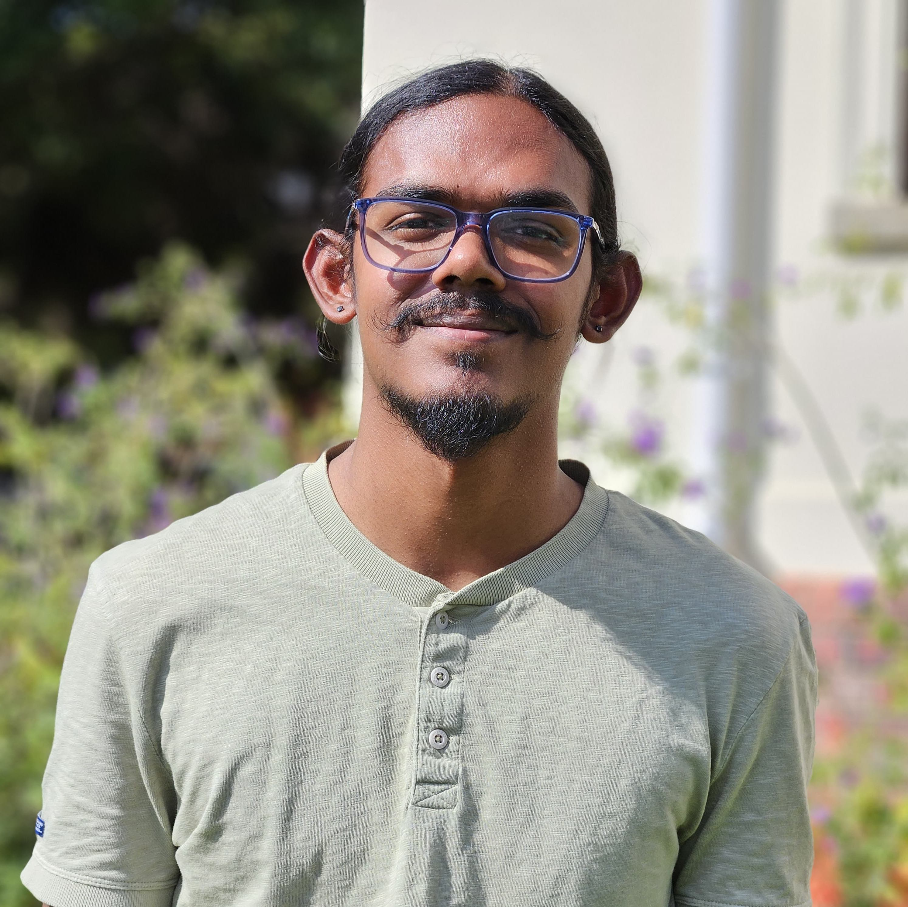

# TuneIn
 

## TuneIn - Apollo - Project Description

Introducing TuneIn, where music becomes a shared experience that connects people, transcending distances and creating lasting bonds through the power of music.

*Elevate Your Music Experience:*
Listening to music is great, but experiencing it together is even better! TuneIn reimagines music as a collective journey, allowing friends and family to synchronise their beats no matter where they are.

Key Features:

- Social Music Sessions: Join online rooms or sessions where you can listen to music in real-time with others, fostering a sense of togetherness and shared enjoyment.
- Personalised Profiles: Showcase your favourite music and current playlists on your profile, allowing others to discover your musical tastes.
- Follow and Connect: Follow friends and artists to stay updated on their music activities and discover new tunes.
- Versatile Room Creation: Host temporary or permanent, public or private rooms where users can chat, vote for songs, and curate playlists together.
- Smart Recommendations: Discover new rooms based on your music preferences, ensuring you always find the perfect vibe.
- Seamless Integration: Connect with popular music platforms like Spotify and YouTube Music, enabling users to add songs from TuneIn sessions directly to their personal library.
- Interactive Features: Engage in voice chat during sessions and even host virtual concerts, creating immersive and dynamic music experiences.

TuneIn isn't just an app—it's a gateway to a world where music brings people closer together. Whether you're sharing a favourite track with friends or discovering new beats in a virtual room, TuneIn is here to amplify the joy of music and strengthen connections. Let's turn up the volume on togetherness with TuneIn!

# 🧑‍💻Meet the team
<table style="border-width: 1px; width: 100%; font-family: Arial, sans-serif; border-collapse: collapse;">
  <tr>
    <td style="vertical-align: top; width:auto; border: 0; padding: 10px;">
      
    </td>
    <td style="vertical-align: top; width: auto; border: 0; padding: 10px;">
      <h2><b style="font-size: 18px;">Linda Masia</b></h2> 
​      <b style="font-size: 16px;">Project Manager | System Architect | UI Engineer (co-lead) </b> 
      I am a detail-oriented final year Computer Science student with a passion for coding and a knack for problem-solving. With a strong background in full-stack web development, database management, and a touch of machine learning expertise, I bring a diverse skill set to the table.  By day, I'm immersed in the world of algorithms and data structures, and by night, I'm conjuring up innovative solutions to real-world problems.
​        
​      <a href="https://github.com/Linda-Masia" style="text-decoration: none; margin-right: 10px; display: inline-block; vertical-align: middle;">
​        
​      </a>
​      <a href="https://www.linkedin.com/in/linda-masia/" style="text-decoration: none; margin-right: 10px; display: inline-block; vertical-align: middle;">
​        
​      </a>
        
      
       
​    </td>
  </tr>
  <tr>
    <td style="vertical-align: top; width:auto; border: 0; padding: 10px;">
      
    </td>
    <td style="vertical-align: top; width: auto; border: 0; padding: 10px;">
      <h2><b style="font-size: 18px;">Lesedi Kekana</b></h2>
      <b style="font-size: 16px;">DevOps Engineer (lead) | Integration Engineer (lead) | Former Project Manager Designer (consultant) | Services Engineer </b> 
      Driven by a passion for computing and problem-solving, I am a final-year BSc Computer Science student with a robust portfolio of successful projects, both in my internship and in personal capacity, translating academic knowledge into real-world applications.   With this technical knowledge and a dedication to continuous learning, through leveraging my problem-solving skills and passion, I am poised to tackle complex challenges, drive innovation, and make impactful contributions to the field of software engineering.
        
      
      
        
      
       
    </td>
  </tr>
  <tr>
​    <td style="vertical-align: top; width:auto; border: 0; padding: 10px;">
      
​    </td>
​    <td style="vertical-align: top; width: auto; border: 0; padding: 10px;">
​      <h2><b style="font-size: 18px;">Nerina Borchard</h2></b>
​      <b style="font-size: 16px;">Designer (lead) | UI Engineer (co-lead) | Services Engineer </b> 
    I am a final-year student at the University of Pretoria, pursuing a degree in Software Development (BSc Information and Knowledge Systems). With a passion for creating and designing innovative solutions, I specialize in crafting user interfaces that are visually appealing, intuitive, and user-friendly.  My goal is to blend aesthetics with functionality, ensuring that every interface I create not only looks good but also works seamlessly to meet the needs of its users.
​        
​      <a href="https://github.com/NerinaBorchard" style="text-decoration: none; margin-right: 10px; display: inline-block; vertical-align: middle;">
​        
​      </a>
​      <a href="https://www.linkedin.com/in/nerina-borchard-68bb482a8/" style="text-decoration: none; margin-right: 10px; display: inline-block; vertical-align: middle;">
​        
​      </a>
      
      
       
​    </td>
  </tr>
  <tr>
​    <td style="vertical-align: top; width:auto; border: 0; padding: 10px;">
      
​    </td>
​    <td style="vertical-align: top; width: auto; border: 0; padding: 10px;">
​      <h2><b style="font-size: 18px;">Thabiso Matau</b></h2>
​      <b style="font-size: 16px;">Business Analyst (co-lead) | Data Engineer (lead) | Services Engineer (lead) | Integration Engineer </b> 
    Highly motivated and dedicated final-year Computer Science student with a focus on Data Science and Mathematical Statistics. I am seeking a position as a Software Engineer or Data Engineer, committed to leveraging my skills and passion for learning new technologies to contribute value to a dynamic workplace.  Organized and dependable, successful at managing multiple priorities with a positive attitude. I am willing to take on added responsibilities to meet team goals.
​        
​      <a href="https://github.com/thabisomatau" style="text-decoration: none; margin-right: 10px; display: inline-block; vertical-align: middle;">
​        
​      </a>
​      <a href="https://www.linkedin.com/in/thabiso-matau-60450425a" style="text-decoration: none; margin-right: 10px; display: inline-block; vertical-align: middle;">
​        
​      </a>
      
      
       
​    </td>
  </tr>
  <tr>
​    <td style="vertical-align: top; width:auto; border: 0; padding: 10px;">
      
​    </td>
​    <td style="vertical-align: top; width: auto; border: 0; padding: 10px;">
​      <h2><b style="font-size: 18px;">Jaden Moodley</b></h2>
​      <b style="font-size: 16px;">Testing Engineer (lead) | Business Analyst (co-lead) | Integration Engineer | Services Engineer </b> 
    As a third-year computer science student, I bring valuable skills and a willingness to learn to this project. With a good understanding of programming languages and problem-solving techniques, gained through my coursework, I'm eager to apply these skills in a real-world setting. My experience working in teams has emphasized the importance of effective communication and cooperation, qualities that I will prioritize in this project.  While I still have much to learn, I'm enthusiastic about expanding my knowledge and embracing new challenges. With attention to detail and a commitment to delivering my best work, I believe I can make a positive contribution to this project and grow as a professional in the process.
​        
​      <a href="https://github.com/u22528492" style="text-decoration: none; margin-right: 10px; display: inline-block; vertical-align: middle;">
​        
​      </a>
​      <a href="https://www.linkedin.com/in/jaden-moodley-4a71012b1" style="text-decoration: none; margin-right: 10px; display: inline-block; vertical-align: middle;">
​        
​      </a>
      
      
       
​    </td>
  </tr>
</table>

## :blue_book: Documentation
[User Manual](https://github.com/COS301-SE-2024/TuneIn/blob/develop/documentation/User%20Manual.pdf)

[Coding Standards/Quality](https://github.com/COS301-SE-2024/TuneIn/blob/develop/documentation/CodingStandards.pdf)

[Testing Policy Document](https://github.com/COS301-SE-2024/TuneIn/blob/develop/documentation/TestingPolicy.pdf)

[our UI design / wireframe](https://www.figma.com/design/vM3jH8s1Xt2CLlFjRRkzQ8/LoFi?node-id=0-1&t=8Qu3n4sAnXvIIUYE-1)

[SRS](https://github.com/COS301-SE-2024/TuneIn/blob/develop/documentation/SRCv4.pdf)

[Technical Installation Manual](https://github.com/COS301-SE-2024/TuneIn/blob/develop/documentation/Techincal%20Installation%20Manual.pdf)

[link to our Functional Requirements document (also included in SRS above)](https://github.com/COS301-SE-2024/TuneIn/blob/main/documentation/FR.md)

## :gear: Technologies

### Frontend
   

### Backend
      

### Streaming Services
 

### More
             

## 📊 Project Management

[link to Project Board (currently private)](https://github.com/orgs/COS301-SE-2024/projects/89)

## :mailbox: ​Contact Us

Team Email: apollo.capstone@gmail.com

