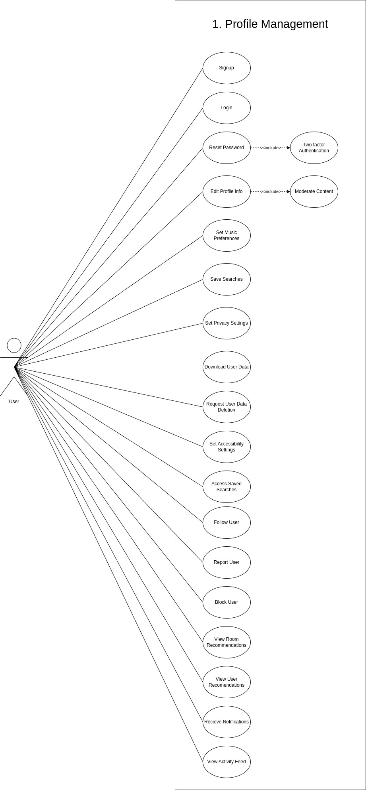
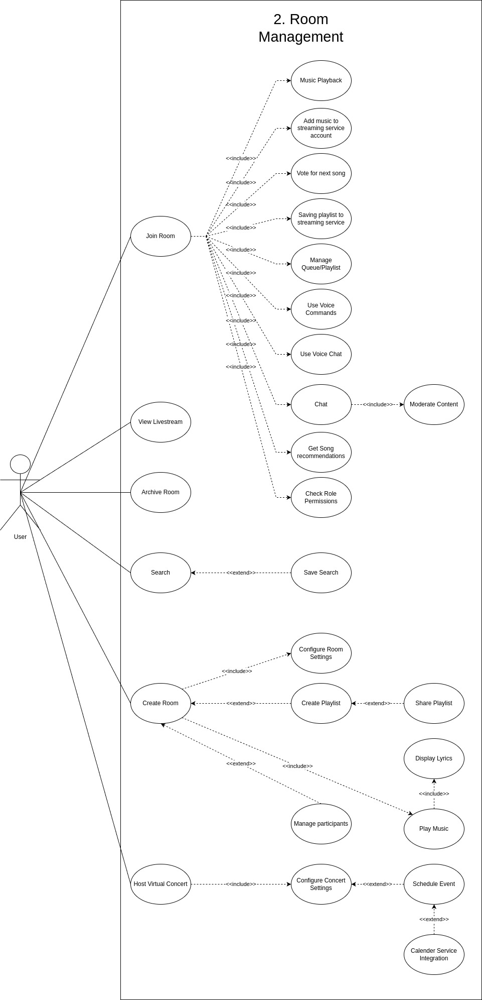
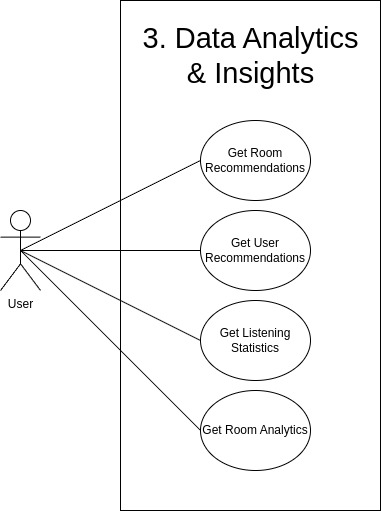
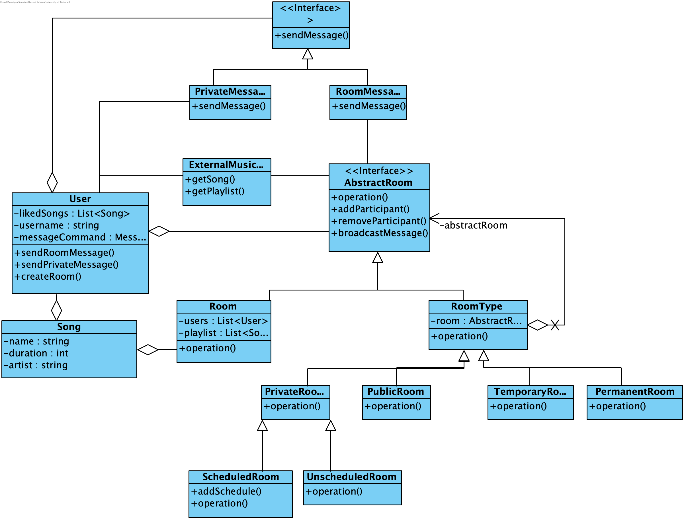

# Software Requirements Specification (SRS)

## 1. Introduction

### 1.1 Purpose

The purpose of this document is to serve as the Software Requirements Specification (SRS) for the development of TuneIn, a social music application. TuneIn aims to transform the way people experience music by making it a shared, interactive, and social activity. The app allows users to create and join interactive music rooms, discover new music based on their preferences, and engage with a community of like-minded music enthusiasts.

The features of TuneIn include user registration and authentication, personalized user profiles, interactive music rooms, real-time music playback, social interactions, music discovery and recommendations, collaborative playlists, virtual concerts, notifications, music analytics, content moderation, event scheduling, advanced search and filters, security and privacy, and accessibility.

This document will serve as a comprehensive guide for the development team, ensuring that all stakeholder needs are met and that the final product aligns with our client (TuneIn)'s expectations.

### 1.2 Scope

The scope of TuneIn includes the following major features and functionalities:

- **User Registration & Authentication**: Sign-up and login options using streaming service accounts, social media accounts, email, and mobile number; password management and two-factor authentication.
- **User Profiles**: Profile creation and management, including the addition of profile pictures, bios, favorite genres, recently visited rooms, bookmarked rooms, favorite songs, and current song display.
- **Interactive Sessions/Rooms**: Creation, configuration, management, and archival of music rooms; room interaction features such as chat and voice chat.
- **Music Playback and Queue Management**: Real-time and synchronized music playback, queue management  and library integration.
- **Social Interaction**: Chat, emojis, voice chat, friendships/following, and user activity feeds.
- **Music Discovery and Recommendations**: Recommendations for rooms, users, and music based on user preferences and trends.
- **Collaborative Playlists**: Creation, management, and sharing of collaborative playlists.
- **Integration with Music Services**: API integration with popular streaming services for music playback and synchronization.
- **Virtual Concerts**: Hosting and participation in virtual concerts.
- **Notification System**: Real-time notifications for various activities and events.
- **Music Analytics and Insights**: Statistics on listening habits and room analytics.
- **Content Moderation**: Automated moderation tools and options to report and block users.
- **Event Calendar and Scheduling**: Scheduling of events such as virtual concerts and listening parties, with calendar integration.
- **Advanced Search and Filters**: Advanced search functionality with filters and saved searches.
- **Security and Privacy**: Data encryption, access control, privacy settings, and data policies.
- **Accessibility, Usability, and Performance**: Responsive design, language translation, accessibility features, and optimized performance.

### 1.3 Overview

This SRS document is structured as follows:

1. **Introduction**: Outlines the purpose, scope, and overview of the document.
2. **Overall Description**: Provides a high-level description of the system, including its context and interactions with other systems.
3. **Specific Requirements**: Details the functional and non-functional requirements of the system.
4. **System Features**: Describes the major features and functionalities of the system in detail.
5. **External Interface Requirements**: Specifies the external interfaces that the system will interact with.
6. **System Architecture**: Outlines the architectural design and components of the system.
7. **Other Non-functional Requirements**: Covers additional requirements such as performance, security, and usability.
8. **Appendices**: Includes any additional information, such as definitions and acronyms.

## 2. User Stories / User Characteristics

### 2.1 User Groups

#### Casual Listener

**Characteristics:**

- Users who either prefer passive music listening, similar to background radio.
- They desire minimal interaction and a simple, intuitive user interface.

#### Social Listener

**Characteristics:**

- Average user looking to enjoy music with friends or meet new people through shared listening experiences.

#### Music Enthusiast

**Characteristics:**

- Passionate about music, deeply engaged in exploring different genres and artists.
- Interested in creating and managing playlists, and connecting with other enthusiasts.
- Users looking to find and connect with others who share similar music tastes.

#### Verified Curator/Artist

**Characteristics:**

- Public figures, influencers, or organisations known for their music expertise.
- Users follow them for their music choices and recommendations.
- Musicians who create and perform music. They use the platform to connect with fans and promote their work.

### 2.2 Catering to User Groups (User Stories)
Our software will cater for above user group in the form of user stories as follows.

####  2.1 Easy Navigation
- **Priority**: High
- **Estimate**: 5
- **User Story**: As a casual listener, I want a simple and intuitive interface to navigate through the app effortlessly.
- **Acceptance Criteria**:
  - Given that the user is logged in, they should be able to access the main music library with one click from the home screen.
  - Given that the user is on the app, key features should be accessible within two clicks.

####  2.2 Minimal Interaction
- **Priority**: Medium
- **Estimate**: 3
- **User Story**: As a casual listener, I want to enjoy music with minimal interaction, so I can play music in the background effortlessly.
- **Acceptance Criteria**:
  - Given that the user is on the app, they should be able to join a room within a single click from the home screen.
  - Given that the user is on the app, playback controls should be straightforward and there should be limited notifications and interactions.
  - Rooms have an auto-play feature for continuous listening.

####  2.3 Consistent Music Streams
- **Priority**: High
- **Estimate**: 5
- **User Story**: As a casual listener, I want a seamless and uninterrupted music streaming experience so I can enjoy music without disruptions.
- **Acceptance Criteria**:
  - Given that the user is playing a song, it should continue playing without buffering or interruptions.
  - Streaming quality adapts to the user’s internet connection.
  - Users can switch between rooms seamlessly.

####  2.4 Advanced Music Discovery
- **Priority**: High
- **Estimate**: 8
- **User Story**: As a music enthusiast, I want advanced music discovery tools, so I can explore various genres and artists based on my interests.
- **Acceptance Criteria**:
  - Given that the user is on the discovery page, when they select filters for genre and artist, then the results must update to show relevant music based on those filters.
  - Recommendations based on the user's listening history are provided.

####  2.5 Tailored Recommendations
- **Priority**: High
- **Estimate**: 8
- **User Story**: As a music enthusiast, I want personalised recommendations on rooms, users, and music based on my preferences and listening trends.
- **Acceptance Criteria**:
  - Given that the user has a listening history, they should receive daily personalised recommendations on their homepage.
  - The system shall recommend rooms and users based on music preferences and current listening trends.
  - Rooms shall suggest new songs or artists based on the music being played.
  - Users can provide feedback on recommendations, thereby enabling the system to improve its recommendations.

####  2.6 Matchmaking
- **Priority**: High
- **Estimate**: 8
- **User Story**: As a music enthusiast, I want effective matchmaking algorithms, so I can find, connect and discuss music with others who share similar music tastes. Therefore being able to share my passion for music with like-minded individuals.
- **Acceptance Criteria**:
  - The user should be able to discover rooms and users that allow them to find like-minded individuals.
  - Users can follow and interact with other enthusiasts and receive notifications about their activities.

####  2.7 Collaborative Playlist Creation and Participation
- **Priority**: High
- **Estimate**: 8
- **User Story**: As a user, I want to create, manage, and share collaborative playlists within a room.
- **Acceptance Criteria**:
  - Users should have the capability to create temporary or permanent rooms, specifying their visibility as either public or private, and configure room settings according to their preferences.
  - Users should be able to manage participants, moderate content and archive or delete rooms.
  - They should be able to invite others to add songs to the room.
  - Users should be able to share playlists with others and export them to personal music accounts.

####  2.8 Profile Personalization
- **Priority**: Medium
- **Estimate**: 5
- **User Story**: As a music enthusiast, I want to personalise my user profile to showcase my musical preferences and connect with others who share similar tastes.
- **Acceptance Criteria**: If the user is editing their profile, they should be able to add a profile picture, bio, favourite genres, rooms recently visited, favourite rooms, favourite songs, other social media profiles and current song playing.

####  2.9 Social Media Integration
- **Priority**: Medium
- **Estimate**: 8
- **User Story**: As a music enthusiast, I want robust social networking features, so I can make new friends and build a community around music.
- **Acceptance Criteria**:
  - Users should be able to follow or befriend other users.
  - Users should be able to specify close friends who may see more detailed information about them and their rooms.
  - Users should be able to see a feed of recent activities from friends and who they follow.

####  2.10 Profile Verification
- **Priority**: High
- **Estimate**: 5
- **User Story**: As a verified curator, I want my profile to be highlighted and verified so that users can trust my recommendations and playlists.
- **Acceptance Criteria**: Given my status, I have a verification badge on my profile and my profile is prominently featured in search results.

####  2.11 Song Analytics
- **Priority**: Medium
- **Estimate**: 8
- **User Story**: As a verified curator, I want analytics to track engagement and feedback, so I can understand my audience/fans better and tailor my content to their preferences.
- **Acceptance Criteria**: Given that the user is a verified curator, they should have access to detailed analytics on fan engagement metrics and exportable analytics data.

####  2.12 Curated rooms
- **Priority**: High
- **Estimate**: 8
- **User Story**: As a verified curator/artist, I want to host rooms and listening sessions, share my playlists, recommend rooms to followers, and engage with a large audience.
- **Acceptance Criteria**: Given that the user is a verified curator, they should be able to host live sessions, share playlists, and recommend rooms to their followers.

####  2.13 Join Friends' Rooms Easily
- **Priority**: High
- **Estimate**: 5
- **User Story**: As a social listener, I want to easily join rooms where my friends are present, so I can enjoy music together with them.
- **Acceptance Criteria**:
  - When the user navigates to the friends' section, they should see a list of their friends' active rooms.
  - The user should be able to click "Join Room" and be redirected to the room their friend is in and start listening to music with them.

####  2.14 Intuitive Room Joining
- **Priority**: High
- **Estimate**: 5
- **User Story**: As a user, I want a simple and intuitive process to join rooms, so I can quickly start listening to music without any hassle.
- **Acceptance Criteria**:
  - The room joining process should require no more than three steps and the UI is designed with clear, simple instructions.

####  2.15 Engage with Others
- **Priority**: High
- **Estimate**: 5
- **User Story**: As a user, I want to have access to social interaction features like chat and emoticons, so I can engage with others while listening to music.
- **Acceptance Criteria**:
  - There should be chat functionality available in rooms.
  - Users can send emojis and react to songs.
  - Users can send direct messages within rooms.

####  2.16 Register
- **Priority**: High
- **Estimate**: 6
- **User Story**: As a potential user of the music app, I want to create an account using my preferred method of registration, including streaming service accounts, social media accounts, email, or mobile number, so that I can access all features and functionalities.
- **Acceptance Criteria**: Users can create an account using their preferred method of registration, including streaming service accounts, social media accounts, email, or mobile number.

####  2.17 Login
- **Priority**: High
- **Estimate**: 7
- **User Story**: As a registered user of the music app, I want to log into my account, so that I can access my personalised content.
- **Acceptance Criteria**: Given a registered user, when I enter my login credentials and submit them, I should be directed to the home page.

####  2.18 Logout
- **Priority**: High
- **Estimate**: 4
- **User Story**: As a logged-in user of the music app, I want to log out of my account.
- **Acceptance Criteria**: Given a logged-in user, when I initiate the logout process, then I should be successfully logged out and redirected to the login page or the default home page.

####  2.19 Advanced Search and Filters
- **Priority**: High
- **Estimate**: 5
- **User Story**: As a user, I want advanced search and filter options to find specific rooms, users, and songs quickly.
- **Acceptance Criteria**:
  - Users should be able to save their search queries for quick access later.

####  2.20 Notification System
- **Priority**: High
- **Estimate**: 6
- **User Story**: As a user, I want to receive real-time notifications for important activities within the app.
- **Acceptance Criteria**: The system shall allow users to receive real-time notifications for room invitations, song recommendations, friend requests, room recommendations, trending rooms and live rooms by artists/curators.

#### 2.21 Integration with Music Services
- **Priority**: High
- **Estimate**: 8
- **User Story**: As a user, I want the app to integrate seamlessly with popular music streaming services for easy access to music.
- **Acceptance Criteria**:
  - The system shall integrate with popular music streaming services to fetch and play music.
  - Users should be able to save collaborative playlists to their streaming service accounts.

#### 2.22 Queue Managment
- **Priority**: High
- **Estimate**: 8
- **User Story**: As a user, I want to be able to add songs to the playlist.
- **Acceptance Criteria**:
  - The system shall integrate with popular music streaming services to allow users to add songs to the queue.
  - Changes should be saved.
  

#### 2.23 Room Creation and Editing
- **Priority**: High
- **Estimate**: 8
- **User Story**: As a user, I want to be able create new rooms and edit the detaisl later.
- **Acceptance Criteria**:
  - The system will allow users to create new rooms and configure its settings.
  - The system allows the user to change the details of the room later and reflects those changes.
 

#### 2.24 Bookmark Rooms
- **Priority**: High
- **Estimate**: 5
- **User Story**: As a user, I want to bookmark my favorite rooms so that I can acces them later.
- **Acceptance Criteria**:
  - The system will allow the user to bookmark a room and it will display in there profile to easily access later.

 
#### 2.25 Playback
- **Priority**: High
- **Estimate**: 8
- **User Story**: As a user, I want control playback in the room I created.
- **Acceptance Criteria**:
  - The system shall integrate with popular music streaming services to fetch and play music.
  - This the allows the user to play or pause the music in the room and skip tracks.

## 3. Functional Requirements

### 3.1 Core Requirements

#### Interactive Sessions/Rooms
- At the heart of TuneIn are the rooms - dynamic spaces where users can come together to share and enjoy music. These rooms can be:
  - **Permanent or Temporary**: Choose how long a room stays active.
  - **Public or Private**: Control the visibility and accessibility of rooms.
- Rooms are the essence of TuneIn, designed to foster the discovery and sharing of musical tastes.

#### Music Discovery and Sharing
- TuneIn recommends rooms based on the music currently playing, enhancing discovery and connection through shared tastes. Users can easily find rooms that match their mood or explore new genres with user-set filters or quick toggles.

#### Collaborative Playlists
- Users can queue songs or playlists, creating a collaborative music experience.

#### Engagement and Interaction
- Rooms support chat functionality, from full-text messages to reaction-based emoticons, encouraging users to share their thoughts and connect over music.

#### Personalized Profiles
- Users can create profiles showcasing their musical preferences, recent rooms visited, and a unique taste profile derived from their activities within the app. This feature enhances personalization and connectivity among users.

#### Social Connectivity
- Users have the ability to follow or befriend each other, building a community of like-minded individuals.

### 3.2 Functional Requirements and Sub-requirements
#### FR1: User Registration & Authentication

##### FR1.1: User Sign-Up
- **FR1.1.1**: Users should be able to create an account using:
  - **FR1.1.1.1**: Their preferred streaming service account
  - **FR1.1.1.2**: Social media accounts
    - **FR1.1.1.2.1**: Google
    - **FR1.1.1.2.2**: Instagram
    - **FR1.1.1.2.3**: Facebook
    - **FR1.1.1.2.4**: X/Twitter
  - **FR1.1.1.3**: Email address
  - **FR1.1.1.4**: Mobile number

##### FR1.2: User Login
- **FR1.2.1**: Users should be able to log in using:
  - **FR1.2.1.1**: Streaming service accounts
  - **FR1.2.1.2**: Social media accounts
  - **FR1.2.1.3**: Login credentials (username and password)

##### FR1.3: Password Management
- **FR1.3.1**: Users should be able to reset their passwords via email.

##### FR1.4: Two-factor Authentication
- **FR1.4.1**: Users should be able to protect their login credentials with 2FA for enhanced security.

#### FR2: User Profiles

##### FR2.1: Profile Creation and Management
- **FR2.1.1**: Users should be able to create and update their profiles.
- **FR2.1.2**: Users should be able to add a profile picture.
- **FR2.1.3**: Users should be able to write a bio.
- **FR2.1.4**: Users should be able to specify favorite genres.
- **FR2.1.5**: Users should be able to see rooms recently visited.
- **FR2.1.6**: Users should be able to bookmark favorite rooms.
- **FR2.1.7**: Users should be able to list favorite songs.
- **FR2.1.8**: Users should be able to link to other profiles.
- **FR2.1.9**: Users should be able to display the song currently playing.

##### FR2.2: Music Preferences
- **FR2.2.1**: Users should be able to import favorite artists, genres, and songs from their streaming service.
- **FR2.2.2**: Users should be able to manually specify favorite artists, genres, and songs.
- **FR2.2.3**: Users should be able to use this information for music recommendations.

#### FR3: Interactive Sessions/Rooms

##### FR3.1: Room Creation
- **FR3.1.1**: Users should be able to create rooms that are:
  - **FR3.1.1.1**: Permanent or temporary
  - **FR3.1.1.2**: Public or private
  - **FR3.1.1.3**: Scheduled

##### FR3.2: Room Settings
- **FR3.2.1**: Users should be able to configure room settings, including:
  - **FR3.2.1.1**: Room name
  - **FR3.2.1.2**: Description
  - **FR3.2.1.3**: Genre
  - **FR3.2.1.4**: Language
  - **FR3.2.1.5**: Explicitness
  - **FR3.2.1.6**: NSFW
  - **FR3.2.1.7**: Playlist photo
  - **FR3.2.1.8**: Visibility/privacy
    - **FR3.2.1.8.1**: Public or private
    - **FR3.2.1.8.2**: Searchable or accessed by link
    - **FR3.2.1.8.3**: Limited to close friends
  - **FR3.2.1.9**: Room size
  - **FR3.2.1.10**: Listener permissions
  - **FR3.2.1.11**: Voice chat enabling
  - **FR3.2.1.12**: Timeout with no playback

##### FR3.3: Room Management
- **FR3.3.1**: Room owners should be able to manage participants.
- **FR3.3.2**: Room owners should be able to moderate content.
- **FR3.3.3**: Room owners should be able to delete the room.

##### FR3.4: Room Archival
- **FR3.4.1**: Users should be able to bookmark a room.
- **FR3.4.2**: Users should be able to save its songs as a playlist for future access.

##### FR3.5: Room Interaction
- **FR3.5.1**: Users should be able to enter and exit rooms.
- **FR3.5.2**: Users should be able to participate and vote in rooms.
- **FR3.5.3**: Users should be able to chat or voice chat in rooms.
- **FR3.5.4**: Users should be able to direct message other users in rooms (if allowed by settings).

#### FR4: Music Playback and Queue Management

##### FR4.1: Music Playback
- **FR4.1.1**: Users should be able to play, pause, and skip tracks within a room.
- **FR4.1.2**: Users should be able to experience real-time and synchronized playback across rooms.

##### FR4.2: Queue/Playlist Management
- **FR4.2.1**: Users should be able to add songs to the queue/playlist.
- **FR4.2.2**: Users should be able to see real-time updates to the queue/playlist.

##### FR4.4: Library Integration
- **FR4.4.1**: Users should be able to add music to their streaming service library during playback.
- **FR4.4.2**: Users should be able to reference songs from their library for queuing.

#### FR5: Social Interaction

##### FR5.1: Chat Functionality
- **FR5.1.1**: Users should be able to send text messages.
- **FR5.1.2**: Users should be able to send emojis/emoticons.
- **FR5.1.3**: Users should be able to send reactions in real-time within a room.

##### FR5.2: Voice Chat
- **FR5.2.1**: Users should be able to engage in voice chat within a room.

##### FR5.3: Friendship/Following
- **FR5.3.1**: Users should be able to follow or befriend other users.
- **FR5.3.2**: Users should be able to receive updates on their activities.
- **FR5.3.3**: Users should be able to specify close friends who may see more detailed information about them and their rooms.

##### FR5.4: User Activity Feed
- **FR5.4.1**: Users should be able to see a feed of recent activities from friends and followed users, such as:
  - **FR5.4.1.1**: Room joins
  - **FR5.4.1.2**: Playlist updates
  - **FR5.4.1.3**: New friend connections

#### FR6: Music Discovery and Recommendations

##### FR6.1: Room Recommendations
- **FR6.1.1**: The system should recommend rooms based on:
  - **FR6.1.1.1**: User's music preferences
  - **FR6.1.1.2**: Current listening trends
  - **FR6.1.1.3**: Currently listened to song
  - **FR6.1.1.4**: Music mood
  - **FR6.1.1.5**: Permanent rooms must recommend music continuously

##### FR6.2: User Recommendations
- **FR6.2.1**: The system should recommend other users to follow based on similar music tastes.

##### FR6.3: Music Suggestions
- **FR6.3.1**: Rooms should suggest new songs or artists based on the music being played.

#### FR7: Collaborative Playlists

##### FR7.1: Playlist Creation
- **FR7.1.1**: Users should be able to create and manage collaborative playlists within a room.

##### FR7.2: Playlist Sharing
- **FR7.2.1**: Users should be able to share playlists with other users.
- **FR7.2.2**: Users should be able to export playlists to their personal music accounts on platforms like Spotify.

#### FR8: Integration with Music Services

##### FR8.1: API Integration
- **FR8.1.1**: The app should integrate with popular music streaming services (e.g., Spotify, YouTube Music) to:
  - **FR8.1.1.1**: Fetch and play music
  - **FR8.1.1.2**: Synchronize libraries

##### FR8.2: Playlist Synchronization
- **FR8.2.1**: Users should be able to save collaborative playlists to their accounts on these services.

#### FR9: Virtual Concerts

##### FR9.1: Live Streaming
- **FR9.1.1**: Users should be able to host and participate in virtual concerts within the app.

##### FR9.2: Concert Management
- **FR9.2.1**: Hosts should be able to manage concert details, including:
  - **FR9.2.1.1**: Schedule
  - **FR9.2.1.2**: Participants

#### FR10: Notification System

##### FR10.1: Real-Time Notifications
- **FR10.1.1**: Users should receive real-time notifications (should they opt-in) for:
  - **FR10.1.1.1**: Room invitations
  - **FR10.1.1.2**: Song recommendations
  - **FR10.1.1.3**: Friend requests
  - **FR10.1.1.4**: Room recommendations
  - **FR10.1.1.5**: Trending rooms
  - **FR10.1.1.6**: Live rooms by artists/curators
  - **FR10.1.1.7**: Other activities

#### FR11: Music Analytics and Insights

##### FR11.1: Listening Stats
- **FR11.1.1**: Users should have access to statistics about their listening habits, such as:
  - **FR11.1.1.1**: Total listening time
  - **FR11.1.1.2**: Most played songs
  - **FR11.1.1.3**: Genres
  - **FR11.1.1.4**: Artists

##### FR11.2: Room Analytics
- **FR11.2.1**: Room creators should be able to see analytics for their rooms, including:
  - **FR11.2.1.1**: Number of participants
  - **FR11.2.1.2**: Most voted songs
  - **FR11.2.1.3**: Activity levels

#### FR12: Content Moderation

##### FR12.1: Automated Moderation
- **FR12.1.1**: Implement automated moderation tools to filter out inappropriate content in:
  - **FR12.1.1.1**: Chat messages
  - **FR12.1.1.2**: User profiles

##### FR12.2: Report and Block
- **FR12.2.1**: Users should be able to report inappropriate behavior.
- **FR12.2.2**: Users should be able to block other users.

#### FR13: Event Calendar and Scheduling

##### FR13.1: Event Scheduling
- **FR13.1.1**: Users should be able to schedule events such as:
  - **FR13.1.1.1**: Virtual concerts
  - **FR13.1.1.2**: Listening parties
  - **FR13.1.1.3**: DJ sessions within the app

##### FR13.2: Calendar Integration
- **FR13.2.1**: Integrate with calendar apps (e.g., Google Calendar) to add reminders for upcoming events.

#### FR14: Advanced Search and Filters

##### FR14.1: Search Functionality
- **FR14.1.1**: Users should be able to search for:
  - **FR14.1.1.1**: Rooms
  - **FR14.1.1.2**: Users
  - **FR14.1.1.3**: Songs using advanced filters like genre, mood, popularity, and activity level

##### FR14.2: Saved Searches
- **FR14.2.1**: Allow users to save their search queries for quick access later.

#### FR15: Security and Privacy

##### FR15.1: Data Encryption
- **FR15.1.1**: All sensitive user data should be encrypted.

##### FR15.2: Access Control
- **FR15.2.1**: Implement role-based access control for managing room permissions and administrative tasks.

##### FR15.3: Privacy Settings
- **FR15.3.1**: Users should be able to configure their privacy settings, including:
  - **FR15.3.1.1**: Profile visibility
  - **FR15.3.1.2**: Data sharing preferences

##### FR15.4: Data Policies
- **FR15.4.1**: Users should be able to request data stored about them for download.
- **FR15.4.2**: Users should be able to request for data to be deleted.

#### FR16: Accessibility, Usability, and Performance

##### FR16.1: Responsive Design
- **FR16.1.1**: The app should be fully responsive and usable on various devices and screen sizes.

##### FR16.2: Language Translation
- **FR16.2.1**: The app should be available in various LLM-powered language translations for a better user experience.

##### FR16.3: Accessibility Features
- **FR16.3.1**: Ensure the app is accessible to users with disabilities by implementing features like:
  - **FR16.3.1.1**: Screen reader support
  - **FR16.3.1.2**: High contrast modes
  - **FR16.3.1.3**: Keyboard navigation

##### FR16.4: Responsiveness
- **FR16.4.1**: The app should be optimized for fast loading times and smooth performance across all devices and network conditions.

## 4. Use Case Diagram

## 5. Class Diagram

### 5.1 Class Diagram

A more elaborate description of how these classes relate is in 6.4 - Design Patterns.

## 6. Architectural Diagram

### 6.1 Architectural Requirements
1. **Domain-Driven Architecture (DDA)**:
   - DDA emphasizes aligning the software design with the problem domain, focusing on understanding the domain's complexities and modeling them effectively within the system.
   - In TuneIn, DDA would involve identifying key domain entities such as users, rooms, music tracks, and interactions between them. These entities should be accurately represented in the software architecture.
   - Domain experts collaborate closely with software developers to ensure that the architectural decisions reflect the nuances of the music streaming domain.
   - The use of bounded contexts, aggregates, and ubiquitous language, as defined in Domain-Driven Design (DDD), helps maintain a clear and consistent understanding of the domain across the development team.

2. **Event-Driven Architecture (EDA)**:
   - EDA facilitates loosely coupled, asynchronous communication between system components through the exchange of events.
   - In TuneIn, events could include actions such as user joining a room, queueing a song, or sending a message in a chat room.
   - By decoupling components and enabling them to react to events independently, EDA enhances scalability, fault tolerance, and responsiveness in the system.
   - Event-driven workflows enable real-time updates, notifications, and collaborative features in TuneIn, enhancing the overall user experience.

3. **Component-Based Architecture**:
   - Component-based architecture breaks down the system into reusable, modular components that encapsulate specific functionality and can be assembled to build larger systems.
   - In TuneIn, components could include modules for user authentication, room management, music playback, recommendation engine, and social networking features.
   - Each component has well-defined interfaces that facilitate communication with other components, promoting modularity, maintainability, and code reuse.
   - Component-based architecture supports scalability by allowing teams to independently develop, test, and deploy components, fostering agility and collaboration.

4. **Scalability**:
   - In TuneIn, scalability is essential to accommodate growing user bases, concurrent room sessions, and streaming traffic.
   - Horizontal scalability involves adding more instances of components to distribute the workload across multiple servers or nodes, while vertical scalability involves upgrading hardware resources to handle increased load.
   - Techniques such as load balancing, caching, and sharding can be employed to scale different parts of the system effectively.

5. **Maintainability**:
   - Maintainability encompasses the ease with which a system can be modified, updated, debugged, and extended over its lifecycle.
   - In TuneIn, maintainability ensures that developers can efficiently address bugs, implement new features, and adapt to changing requirements without introducing regressions or compromising system integrity.
   - Practices such as modular design, code refactoring, version control, automated testing, and documentation contribute to maintainability by promoting clean, organized, and understandable codebases.
   - Architectural patterns like MVC (Model-View-Controller) and MVVM (Model-View-ViewModel) can help enforce separation of concerns and facilitate maintainable code architecture.

### 6.2 Quality Requirements
#### Performance

- **Specification:**
  - Low-latency for streaming and social interaction
  - App should be responsive
  - Acceptable limits for network usage to ensure efficient operation.

- **Quantification:**
  - The system shall process up to 25 transactions per second for end-users

#### Security

- **Specification:**
  - Ensure proper user roles and permissions are defined and enforced
  - Utilise prepared SQL queries
  - Password Hashing and Salting
  - Rate limitation
  - All user data shall be encrypted using AES-256
  - Implement comprehensive logging and monitoring for security events, ensuring logs are tamper-proof and reviewed regularly
  - API Guard
    - IP whitelisting
    - API Keys

- **Quantification:**
  - Input should be validated and sanitised to prevent SQL injection attacks
  - Check that the API is only used by the app

#### Scalability

- **Specification:**
  - Allow more storage to be allocated to the database so more users can register if necessary.

- **Quantification:**
  - Load testing

#### Usability

- **Specification:**
  - Ensure that the interface is intuitive and easy to navigate for all user types
  - Ensure that the app responds quickly to user interactions

- **Quantification:**
  - Usability testing

  

#### Maintainability

- **Loosely Coupling**:
  - Write self-explanatory code
  - Abstraction
  - Utilise design patterns
  - Minimise dependencies
  - Use dependency injection
- **Ease of Collaboration**:
  - Follow consistent coding style
  - Code readability
    - Documentation will be generated using Typedoc
  - Component based design
  - Use descriptive commit messages
  - Gitflow branching strategy
- **RESTful API**:
  - Intuitive endpoint naming
  - API scoping
  - API logs
    - Provide clear error messages

#### Portability

- Platform compatibility by making a Native PWA for Android and IOS using Flutter
- Interoperability
  - OAuth
  - Streaming service Integration
- Manage and document software dependencies to avoid conflicts and ensure smooth deployment across different environments
  - Use of package managers
  - Dependency Locking
  - Listing Dependencies

#### Reliability

- **Specification:**
  - Low Downtimes:
    - Utilise rolling updates to add updates one at a time
    - Monitor the status of the deployed updates before deploying more
    - Rollback faulty updates
  - Fault Tolerance
    - Through component based design, if one part of the app fails, the system can still run
  - Backup and Restore Procedures
    - Backup critical data
    - Regularly test backup integrity

- **Quantification:**
  - 10 seconds is the maximum acceptable downtime

### 6.3 Architectural Patterns
#### What we use in our Architecture

1. **Domain-Driven Architecture (DDA)**:
   - **Core Concepts**: DDA emphasizes understanding and modeling the problem domain within the software design. It involves identifying core domain entities, defining their relationships, and encapsulating domain logic within these entities.
   - **Application in TuneIn**: In TuneIn, domain-driven design involves identifying key domain entities like users, rooms, playlists, and interactions. These entities would have associated behaviors and relationships. For example, a "Room" entity might have methods for adding songs, and managing participants. DDA ensures that the software model closely mirrors the real-world domain, leading to a more intuitive and maintainable system.
2. **Event-Driven Architecture (EDA)**:
   - **Core Concepts**: EDA revolves around the concept of events, which represent significant occurrences or state changes within the system. Events are produced, detected, consumed, and reacted to asynchronously.
   - **Application in TuneIn**: In TuneIn, events could represent various user actions (joining a room, liking a song), system events (room created, playlist updated), or external integrations (new music added from Spotify). EDA facilitates real-time communication and responsiveness by enabling components to react to events asynchronously. For example, when a user joins a room, an event triggers the playback of the current song for that user and notifies other participants.
3. **Component-Based Architecture**:
   - **Core Concepts**: Component-Based Architecture involves breaking down the system into reusable, modular components, each responsible for specific functionalities. Components encapsulate related behavior and data, promoting reusability and maintainability.
   - **Application in TuneIn**: TuneIn can implement components for user authentication, room management, music playback, chat functionality, recommendation engines, and social interactions. Each component provides well-defined interfaces for interaction with other components, allowing developers to update or replace individual components without affecting the entire system. For example, the user authentication component handles user login, registration, and session management independently of other components.

4. **Model-View-Controller (MVC) Architecture**:
   - **Core Concepts**: MVC architecture separates an application into three interconnected components: the Model, View, and Controller. The Model represents the data and business logic, the View displays the data, and the Controller handles user input and interacts with the Model.
   - **Application in TuneIn**: In TuneIn, MVC can be used to structure the application such that user interactions are handled efficiently and logically. The Model could manage data related to users, rooms, and playlists. The View would be responsible for displaying the user interface, showing rooms, playlists, and current songs. The Controller would manage input from users, such as joining a room and updating playlists. This separation ensures a clean codebase, where the business logic, UI, and input handling are distinctly managed, promoting maintainability and scalability. For example, when a user likes a song, the Controller updates the Model, and the View reflects this change, ensuring a responsive and consistent user experience.

#### What we didn't use & why

##### 1. Layered (N-Tier) Architecture

**Description:**
- A traditional architectural pattern that organizes the system into layers, typically including presentation, business logic, and data access layers.

**Reason for Exclusion:**
- **Scalability Limitations**: Layered architecture can become monolithic and difficult to scale horizontally. Each layer often depends on the layers below it, creating tight coupling and potential bottlenecks.
- **Flexibility**: As TuneIn requires real-time updates and high scalability, the tightly coupled nature of layered architecture could hinder the agility needed for rapid feature development and deployment.

##### 2. Client-Server Architecture

**Description:**
- A distributed architecture model where client devices interact with a centralized server for data and processing.

**Reason for Exclusion:**
- **Scalability and Real-Time Updates**: While this model is simple and straightforward, it does not inherently support real-time updates or event-driven interactions as efficiently as EDA. TuneIn’s need for real-time notifications and updates is better supported by event-driven and component-based architectures.
- **Single Point of Failure**: A centralized server can become a single point of failure, affecting the overall system’s reliability and fault tolerance.

##### 3. Service-Oriented Architecture (SOA)

**Description:**
- An architectural pattern where services communicate over a network to provide functionality. SOA typically uses SOAP or REST for service interactions.

**Reason for Exclusion:**
- **Granularity and Independence**: Microservices architecture, an evolution of SOA, offers finer granularity and greater independence of services. This fits TuneIn’s needs better by allowing more flexible and independent deployment and scaling of services.
- **Complexity and Overhead**: SOA often involves significant overhead in terms of governance, standards, and tooling, which can be more complex to manage than a component-based approach.

##### 4. Monolithic Architecture

**Description:**
- An architecture where all components and services are packaged together in a single unit.

**Reason for Exclusion:**
- **Scalability and Flexibility**: Monolithic architecture is not well-suited for the scalability and agility required by TuneIn. As the user base grows and new features are added, the monolithic structure can become a bottleneck, making it difficult to scale and deploy changes independently.
- **Maintenance**: Updating a monolithic application can be cumbersome and risky, as a single change can impact the entire system.

##### 5. Peer-to-Peer (P2P) Architecture

**Description:**
- A decentralized network architecture where each node (peer) can act as both a client and a server.

**Reason for Exclusion:**
- **Consistency and Control**: P2P architecture is less suitable for applications requiring consistent data states and central control over interactions and data management. TuneIn’s need for centralized control over user data, rooms, and playlists does not align well with the decentralized nature of P2P.
- **Complexity in Implementation**: Managing consistency, security, and performance in a P2P network can be complex and is often overkill for the requirements of a music streaming and social interaction platform.

##### 6. Event-Sourcing and CQRS (Command Query Responsibility Segregation)

**Description:**
- Event-Sourcing involves storing state changes as a sequence of events. CQRS separates read and write operations to optimize performance and scalability.

**Reason for Exclusion:**
- **Complexity and Overhead**: Event-Sourcing and CQRS introduce significant complexity in terms of maintaining and replaying event logs and managing eventual consistency. While beneficial in some contexts, the overhead might not justify the benefits for TuneIn, especially when simpler and well-supported patterns like EDA and MVC suffice.
- **Specific Use Cases**: These patterns are particularly useful for complex domains with high concurrency and need for audit trails, which may be beyond the current scope of TuneIn.

##### 7. Microservices Architecture

**Description:**
- Microservices Architecture decomposes the application into smaller, independently deployable services, each responsible for a specific business capability. Microservices communicate via lightweight protocols like HTTP or messaging queues.

**Reason for Exclusion:**
- **Experience and Complexity**: The team lacks experience with microservices, and implementing this pattern would add extra difficulty. Given that we are already managing the challenges of Flutter and AWS infrastructure, the additional complexity and learning curve of microservices are not justifiable for this project.
- **Overhead and Maintenance**: Managing microservices involves significant overhead in terms of deployment, monitoring, and inter-service communication, which can complicate development and maintenance.

#### Prioritized Patterns and Their Justification

##### Domain-Driven Architecture (DDA)
- **Alignment with Business Logic**: DDA ensures that the system’s design closely mirrors the business domain, which is essential for complex domains like music streaming and social interactions.
- **Collaboration with Domain Experts**: Encourages ongoing collaboration between developers and domain experts, leading to a more accurate and adaptable system.

##### Event-Driven Architecture (EDA)
- **Real-Time Updates**: Supports real-time notifications and asynchronous processing, enhancing user experience with instant updates and interactions.
- **Decoupling Components**: Facilitates loose coupling between components, improving scalability and fault tolerance.

##### Component-Based Architecture
- **Modularity and Reusability**: Breaks the system into reusable, independent components, promoting maintainability and easier testing and deployment.
- **Scalability**: Each component can be scaled independently, allowing for more efficient resource utilization.

##### Model-View-Controller (MVC) Architecture
- **Separation of Concerns**: Separates the application into Model, View, and Controller components, making it easier to manage and scale the codebase.
- **Efficient User Interaction**: MVC allows for efficient handling of user input and dynamic updates to the user interface, which is crucial for an interactive application like TuneIn.
- **Maintainability**: By isolating the business logic, user interface, and input control, MVC promotes maintainability and easier debugging.

#### Conclusion

While other architectural patterns could potentially work for TuneIn, the chosen patterns—Domain-Driven Architecture, Event-Driven Architecture, Component-Based Architecture, and Model-View-Controller Architecture—provide the best fit for the project’s specific requirements. These patterns offer the necessary scalability, flexibility, and maintainability, ensuring that TuneIn can efficiently handle real-time interactions, growing user bases, and continuous feature enhancements.

### 6.4 Design Patterns
#### **1. Command Pattern**

**Classes Involved**: Message, PrivateMessage, RoomMessage, User

**Justification**: The Command Pattern is used to encapsulate all the information needed to perform an action or trigger an event at a later time. In this application, the pattern is particularly useful for sending messages (both private and room messages). It allows encapsulating the sender, receiver, and the content of the message in a command object.

- **Message Interface**: This defines the sendMessage() method that all concrete message types must implement.
- **PrivateMessage and RoomMessage Classes**: These concrete classes implement the Message interface, providing specific implementations for sending private messages and broadcasting messages in a room, respectively.
- **User Class**: The User class can execute different commands (sendRoomMessage() and sendPrivateMessage()) which utilize the Command Pattern to perform the respective actions.

**Benefits**:

- **Decoupling**: The sender and receiver are decoupled, allowing for more flexible and reusable code.
- **Undo/Redo Functionality**: Commands can be stored and thus can provide undo and redo functionality.
- **Logging**: Commands can be logged for auditing purposes.

#### **2. Observer Pattern**

**Classes Involved**: AbstractRoom, Room, User

**Justification**: The Observer Pattern is used to create a subscription mechanism to allow multiple objects (users) to listen to events (messages) and be notified when those events occur. This pattern is ideal for broadcasting messages in a chat room where all users need to receive the messages sent to the room.

- **AbstractRoom Interface**: This interface defines the methods addParticipant(), removeParticipant(), and broadcastMessage().
- **Room Class**: Implements the AbstractRoom interface and maintains a list of users. When a message is broadcasted, all users in the room are notified.
- **User Class**: Users register themselves with rooms to receive messages and can also remove themselves when they no longer wish to receive updates.

**Benefits**:

- **Loose Coupling**: The subject (room) and observers (users) are loosely coupled, allowing for changes without affecting each other.
- **Dynamic Subscription**: Users can dynamically subscribe or unsubscribe to rooms.

#### **3. Decorator Pattern**

**Classes Involved**: AbstractRoom, RoomType, PrivateRoom, PublicRoom, TemporaryRoom, PermanentRoom, ScheduledRoom, UnscheduledRoom

**Justification**: The Decorator Pattern is used to add behavior or responsibilities to objects at runtime. This pattern fits well with the room types which can have various additional features or states (e.g., private, public, temporary, permanent, scheduled, unscheduled).

- **AbstractRoom Interface**: Defines the basic operations of a room.
- **RoomType Class**: Acts as the base decorator, holding a reference to an AbstractRoom object.
- **Concrete Decorators (PrivateRoom, PublicRoom, etc.)**: Each concrete decorator extends the RoomType class and adds specific behavior or state to the room.

**Benefits**:

- **Flexibility**: Behaviors can be added or removed dynamically.
- **Single Responsibility Principle**: Each decorator class handles a specific aspect of the room's behavior.
- **Open/Closed Principle**: New decorators can be added without changing the existing code.

#### **In Summary**

1. **Message Interface and Its Implementations**:
   - The Message interface and its concrete implementations (PrivateMessage, RoomMessage) represent commands that encapsulate the information needed to perform messaging actions.
2. **User Class**:
   - The User class acts as the invoker of commands, allowing users to send both room messages and private messages.
3. **AbstractRoom Interface and Room Class**:
   - The AbstractRoom interface and its implementation in the Room class handle the observer pattern, managing user subscriptions and broadcasting messages to all participants.
4. **RoomType and Concrete Decorators**:

The RoomType class and its concrete decorators (PrivateRoom, PublicRoom, TemporaryRoom, PermanentRoom, ScheduledRoom, UnscheduledRoom) implement the Decorator Pattern to dynamically add responsibilities and features to room objects.

### 6.5 Constraints
#### 1. Project Constraints

**Timeline** 
As was eloquently said by our Assistant Lecturer, Mr. LM (Liam) Burgess, our targets for the percentage of features we will have implemented by each demo are:

- Demo 1: ~15% of features done - POC
- Demo 2: ~40% of features done - MVP
- Demo 3: ~80% of features done - Alpha
- Demo 4 (exam): ~100% of features done - Beta
- Project Day - Release

**Budget** 
(a budget containing fees for weeks from 14 May 2024 to 25 Oct 2024 - 23 weeks using a rate of R500 per hour per dev)

Development Team: 5 developers 
Hourly Rate per Developer: R500 
Weekly Hours per Developer: 40 hours 
Total Weekly Cost: 5 developers * 40 hours/week * R500/hour = R100,000 
Total Project Cost: 23 weeks * R100,000/week = R2,300,000  

**Scope** 
Core Features: Interactive rooms, music discovery and sharing, collaborative playlists, chat functionality, personalized profiles, social connectivity. 
Additional Features: Integration with Spotify and Apple Music, lyrics display, voice interaction, virtual concerts.

**Team Availability** 
Development Team: 5 developers available full-time. 
Working Hours: 40 hours per week, with team members in the same or closely aligned time zones (SAST).

#### 2. Cloud Constraints

**Provider Limitations** 
Provider: Amazon Web Services (AWS) free tier 
Service Availability: Ensure all required services (EC2, S3, DynamoDB, Lambda) are available within the free tier limits.

**Cost** 
Monthly Cloud Budget: ZAR 0 (must utilize free tier offerings) 
Compute Costs (EC2): Up to 750 hours per month of t2.micro instances. 
Storage Costs (S3, DynamoDB): Up to 5 GB of S3 storage and 25 GB of DynamoDB storage. 
Data Transfer and Network Costs: 1 GB egress per month. 
Miscellaneous (Lambda, API Gateway): Utilize free tier limits.

**Performance** 
Scalability Limits: Limited to free tier quotas (e.g., 750 hours of t2.micro instances, 5 GB storage). 
Data Transfer Rates: Ensure data transfer rates do not exceed free tier limits (1 GB egress).

**Compliance** 
Regulatory Requirements: GDPR compliance for user data privacy, adherence to HIPAA standards for any health-related data, PCI-DSS compliance for handling payment information.

#### 3. Architectural Constraints

**Design Patterns** 
Architectural Styles: Domain-Driven Design (DDD) with Event-Driven Architecture (EDA) and Model-View-Controller (MVC). 
Communication: Use of RESTful APIs and asynchronous messaging (SNS/SQS).

**Scalability** 
Vertical Scaling: Limited by free tier instance size. 
Horizontal Scaling: Utilize auto-scaling within free tier limits e.g., scaling Lambda functions).

**Maintainability** 
Code Quality: Enforce code reviews and use static analysis tools (e.g., ESLint for JavaScript/TypeScript). 
Documentation: Comprehensive documentation for each service and module.

**Security** 
Encryption: Data at rest and in transit must be encrypted using industry standards (AES-256, TLS 1.2+). 
Access Controls: Role-based access controls (RBAC) implemented using AWS IAM.

#### 4. Technology Stack Constraints

**Front-End** 
Technology: React Native for cross-platform development (iOS, Android). 
Limitations: Ensuring consistent performance across different devices and screen sizes.

**Back-End** 
Technology: Nest.js with Prisma ORM, Swagger/OpenAPI specification API,
JWT auth tokens Socket.io. 
Constraints: .

**Database** 
Primary Database: AWS RDS for structured data.
PostGres RDS.
Secondary Database: None due to free tier limitations (consider in-memory caching using Lambda).

**APIs** 
Third-Party APIs: Spotify API for music metadata, Musixmatch API for lyrics. 
Rate Limits: Ensure usage stays within free tier limits or budgeted API calls.

#### 5. Integration Constraints

**Third-Party Services**  
Spotify: Must handle OAuth for user authentication.  
Apple Music: Integration for additional music content.  
Musixmatch: API integration for lyrics, ensuring compliance with their terms of service.

**Data Synchronization**  
Mechanism: Use AWS CloudWatch Events and Lambda for periodic synchronization.  
Frequency: Synchronization tasks scheduled hourly.

**Compatibility**  
Devices: Support for Android (API level 21+) and iOS (iOS 11+).  
Operating Systems: Ensure compatibility with the latest two versions of Android and iOS.

#### 6. Legal and Regulatory Constraints

**Licensing**  
Music Licensing: Ensure compliance with licensing agreements for all music content.  
Streaming Rights: Verification of regional streaming rights.

**Privacy**  
Data Handling: User data must be handled in compliance with GDPR and CCPA.  
User Consent: Obtain explicit consent for data collection and processing.

**Intellectual Property**  
Copyright: Ensure no infringement of copyrighted materials.  
Trademark: Proper usage of trademarks and logos as per legal agreements.

#### 7. Operational Constraints

**Deployment**  
CI/CD Pipelines: Use GitHub Actions for continuous integration and deployment.  
Environment Configurations: Separate configurations for development, staging, and production environments.

**Monitoring**  
Tools: CloudWatch for infrastructure monitoring, and logging.  
Metrics: Monitor key performance indicators (KPIs) such as uptime, response time, and error rates.

**Support**  
Support Plan: During the development phase, developers provide on-call support for critical issues.  
Issue Tracking: Use GitHub Issues for tracking bugs and user issues.

#### 8. Usability and Accessibility Constraints

**User Experience**  
Responsive Design: Ensure the application is fully responsive and works seamlessly on different screen sizes.  
Navigation: Intuitive navigation with minimal learning curve for new users.

**Accessibility**  
WCAG Compliance: Adhere to WCAG 2.1 guidelines for web content accessibility.  
Features: Implement screen reader support, keyboard navigation, and color contrast settings.

#### 9. Performance Constraints

**Response Time**  
API Response Time: Average response time must be under 300ms.  
Page Load Time: Web pages should load within 2 seconds on average.

**Load Handling**  
Concurrent Users: Support for up to 500 concurrent users.  
Transactions: Handle up to 50,000 transactions per day.

**Uptime**  
Downtime Limits: Scheduled maintenance windows not exceeding 1 hour per month.

#### 10. Resource Constraints

**Hardware**  
Development: Standardized development environments with minimum specs (8GB RAM, SSD storage, quad-core CPU).  
Testing: Use of virtualized environments for testing across different configurations.

**Software**  
Licensing: Use open-source tools where possible to minimize costs.  
Restrictions: Ensure all software tools comply with licensing agreements and are compatible with the chosen technology stack.

### 6.6 Technology Requirements
### Technology Requirements

1. **Front-End**:
   - **Framework**: React Native(Expo) for building the native mobile application to ensure a seamless, cross-platform experience.
2. **Back-End**:
   - **Node.js**:
     - **NestJS**: Utilize NestJS for building scalable and maintainable server-side applications.
3. **Hosting**:
   - **AWS (Amazon Web Services)**: Leverage AWS for its wide range of services, scalability, and reliability.
4. **Database**:
   - **PostgreSQL (SQL)**: Potentially, use SQL for its strong ACID principles and strong schema validation & enforcement.
5. **APIs and Integrations**:
   - **Music Services Integration**: Integrate with music streaming services like Spotify and Apple Music to enhance the shared listening experience.